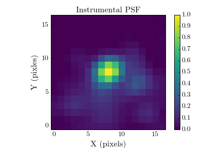
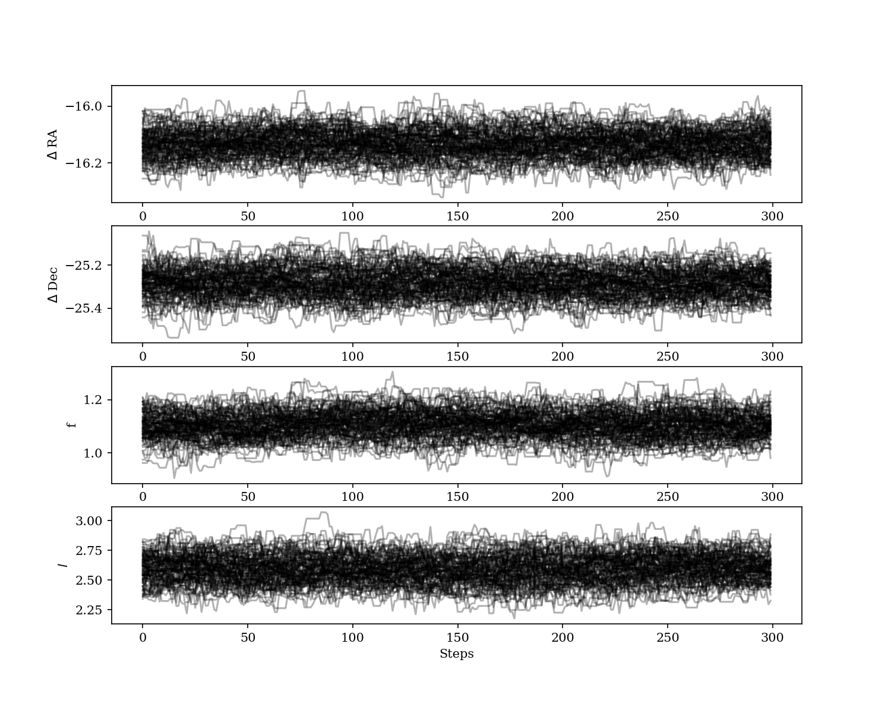
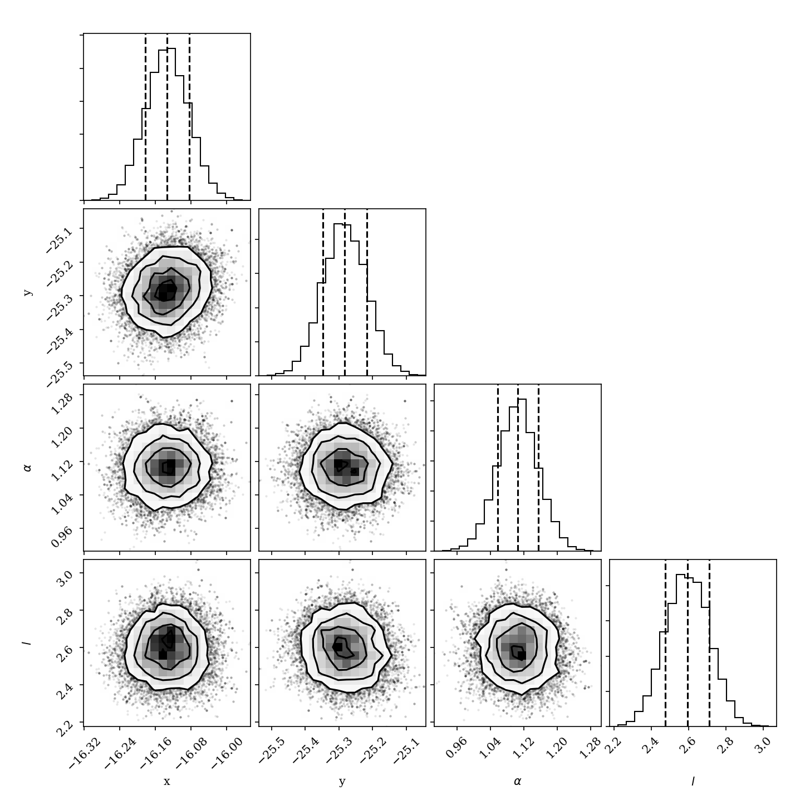
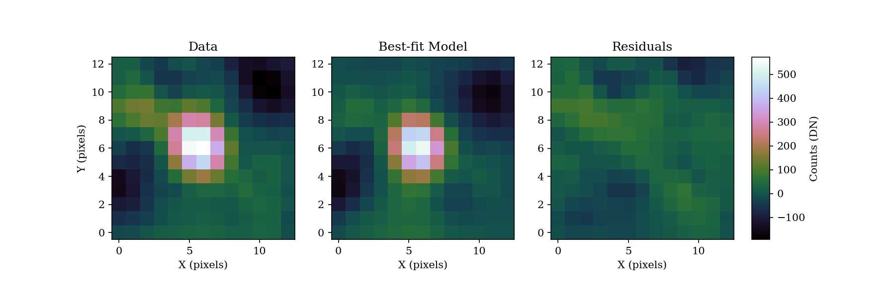

.. _bka-label:

Foward-Model Astrometry and Photometry
======================================

pyKLIP offers PSF fitting as the most optimal method for extraction of planet astrometry and photometry. 
Astrometry/photometry of directly imaged exoplanets is challenging since PSF subtraction algorithms (like pyKLIP)
distort the PSF of the planet. `Pueyo (2016) <http://arxiv.org/abs/1604.06097>`_ provide a technique to
forward model the PSF of a planet through KLIP. 
Taking this forward model, you could fit it to the data, but you would underestimate your errors because the noise in direct imaging data is correlated
(i.e. each pixel is not independent). To account for the correlated nature of the noise, we use Gaussian
process regression to model and account for the correlated nature of the noise. This allows us to obtain
accurate measurements and accurate uncertainties on the planet parameters.

The code was originally designed for the Bayesian KLIP-FM Astorometry technique (BKA)
that is described in `Wang et al. (2016) <https://arxiv.org/abs/1607.05272>`_ to obtain one milliarcsecond
astrometry on β Pictoris b.
Since then, it has be extended to also do maximum likelihood fitting in a frequentist framework that can also
obtain uncertainties. A frequentist framework is appropriate when astrometric calibration uncertainties are 
also derived in a frequentist procedure. 

Requirements
------------
You need the following pieces of data to forward model the data. (If you have a model and some data to fit to, you can
skip the section on using KLIP-FM to generate a forawrd model PSF.)

* Data to run PSF subtraction on
* A model or data of the instrumental PSF
* A good guess of the position of the planet (a center of light centroid routine should get the astrometry to a pixel)
* For IFS data, an estimate of the spectrum of the planet (it does not need to be very accurate, and 20% errors are fine)

If you want to run BKA, you need the additional packages installed, which should be available readily:

* `emcee <http://dan.iel.fm/emcee/current/>`_
* `corner <https://github.com/dfm/corner.py>`_

Generating instrumental PSFs for GPI
^^^^^^^^^^^^^^^^^^^^^^^^^^^^^^^^^^^^^
A quick aside for GPI spectral mode data, here is how to generate the instrumental PSF from the satellite spots.

.. code-block:: python

    import glob
    import numpy as np
    import pyklip.instruments.GPI as GPI

    # read in the data into a dataset
    filelist = glob.glob("path/to/dataset/*.fits")
    dataset = GPI.GPIData(filelist)

    # generate instrumental PSF
    boxsize = 17 # we want a 17x17 pixel box centered on the instrumental PSF
    dataset.generate_psfs(boxrad=boxsize//2) # this function extracts the satellite spots from the data
    # now dataset.psfs contains a 37x25x25 spectral cube with the instrumental PSF
    # normalize the instrumental PSF so the peak flux is unity
    dataset.psfs /= (np.mean(dataset.spot_flux.reshape([dataset.spot_flux.shape[0] // 37, 37]),
                             axis=0)[:, None, None])

Here is an exmaple using three datacubes from the publicly available GPI data on beta Pic.
Note that the wings of the PSF are somewhat noisy, due to the fact the speckle noise
in J-band is high near the satellite spots. However, this should still give us an acceptable instrumental PSF.

Forward Modelling the PSF with KLIP-FM
---------------------------------------
With an estimate of the planet position, the instrumental PSF, and, if applicable, an estimate of the spectrum,
we can use the :py:mod:`pyklip.fm` implementation of KLIP-FM and :py:class:`pyklip.fmlib.fmpsf.FMPlanetPSF` extension to
forward model the PSF of a planet through KLIP.

First, let us initalize :py:class:`pyklip.fmlib.fmpsf.FMPlanetPSF` to forward model the planet in our data.

For GPI, we are using normalized copies of the satellite spots as our input PSFs, and because of that, we need to pass in
a flux conversion value, ``dn_per_contrast``, that allows us to scale our ``guessflux`` in contrast units to data units. If
you are not using normalized PSFs, ``dn_per_contrast`` should be the factor that scales your input PSF to the flux of the 
unocculted star. If your input PSF is already scaled to the flux of the stellar PSF, ``dn_per_contrast`` is optional 
and should not actually be passed into the function.

.. code-block:: python

    # setup FM guesses
    # You should change these to be suited to your data!
    numbasis = np.array([1, 7, 100]) # KL basis cutoffs you want to try
    guesssep = 30.1 # estimate of separation in pixels
    guesspa = 212.2 # estimate of position angle, in degrees
    guessflux = 5e-5 # estimated contrast
    dn_per_contrast = your_flux_conversion # factor to scale PSF to star PSF. For GPI, this is dataset.dn_per_contrast
    guessspec = your_spectrum # should be 1-D array with number of elements = np.size(np.unique(dataset.wvs))

    # initialize the FM Planet PSF class
    import pyklip.fmlib.fmpsf as fmpsf
    fm_class = fmpsf.FMPlanetPSF(dataset.input.shape, numbasis, guesssep, guesspa, guessflux, dataset.psfs,
                                 np.unique(dataset.wvs), dn_per_contrast, star_spt='A6',
                                 spectrallib=[guessspec])

.. note::
   When executing the initializing of FMPlanetPSF, you will get a warning along the lines of
   "The coefficients of the spline returned have been computed as the minimal norm least-squares solution of a
   (numerically) rank deficient system." This is completeness normal and expected, and should not be an issue.

Next we will run KLIP-FM with the :py:mod:`pyklip.fm` module. Before we run it, we will need to pick our
PSF subtraction parameters (see the :ref:`basic-tutorial-label` for more details on picking KLIP parameters).
For our zones, we will run KLIP only on one zone: an annulus centered on the guessed location of the planet with
a width of 30 pixels. The width just needs to be big enough that you see the entire planet PSF.

.. code-block:: python

    # PSF subtraction parameters
    # You should change these to be suited to your data!
    outputdir = "." # where to write the output files
    prefix = "betpic-131210-j-fmpsf" # fileprefix for the output files
    annulus_bounds = [[guesssep-15, guesssep+15]] # one annulus centered on the planet
    subsections = 1 # we are not breaking up the annulus
    padding = 0 # we are not padding our zones
    movement = 4 # we are using an conservative exclusion criteria of 4 pixels

    # run KLIP-FM
    import pyklip.fm as fm
    fm.klip_dataset(dataset, fm_class, outputdir=outputdir, fileprefix=prefix, numbasis=numbasis,
                    annuli=annulus_bounds, subsections=subsections, padding=padding, movement=movement)

This will now run KLIP-FM, producing both a PSF subtracted image of the data and a forward-modelled PSF of the planet
at the gussed location of the planet. The PSF subtracted image as the "-klipped-" string in its filename, while the
forward-modelled planet PSF has the "-fmpsf-" string in its filename.

Fitting the Planet PSF
----------------------
Now that we have the forward-modeled PSF and the data, we can fit the model PSF to the data and obtain 
the astrometry/photometry of the point source. To do it the Bayesian way with MCMC or the frequentist
way with maximum likelihood is very similar in the code, and will produce similar results as both frameworks
use the forward-modeled PSF and Gaussian process regression. The difference
is interpretation, and determining which framework makes sense for your analysis (e.g., if the instrument
calibration was done in a Bayesian sense, then doing the fit in a Bayesian way is appropriate to properly
combine calibration uncertainties with measurement uncertainties).

First, let's read in the data from our previous forward modelling. We will take the collapsed
KL mode cubes, and select the KL mode cutoff we want to use. For the example, we will use
7 KL modes to model and subtract off the stellar PSF.

.. code-block:: python

    import os
    import astropy.io.fits as fits
    # read in outputs
    output_prefix = os.path.join(outputdir, prefix)
    fm_hdu = fits.open(output_prefix + "-fmpsf-KLmodes-all.fits")
    data_hdu = fits.open(output_prefix + "-klipped-KLmodes-all.fits")

    # get FM frame, use KL=7
    fm_frame = fm_hdu[1].data[1]
    fm_centx = fm_hdu[1].header['PSFCENTX']
    fm_centy = fm_hdu[1].header['PSFCENTY']

    # get data_stamp frame, use KL=7
    data_frame = data_hdu[1].data[1]
    data_centx = data_hdu[1].header["PSFCENTX"]
    data_centy = data_hdu[1].header["PSFCENTY"]

    # get initial guesses
    guesssep = fm_hdu[0].header['FM_SEP']
    guesspa = fm_hdu[0].header['FM_PA']

We will generate a :py:class:`pyklip.fitpsf.FMAstrometry` object that we handle all of the fitting processes.
The first thing we will do is create this object, and feed it in the data and forward model. It will use them to
generate stamps of the data and forward model which can be accessed using ``fit.data_stmap`` and ``fit.fm_stamp``
respectively. When reading in the data, it will also generate a noise map for the data stamp by computing the standard
deviation around an annulus, with the planet masked out. Here, we will also specify whether we will use a maximum likliehood
or MCMC technique to derive the best-fit and uncertainties using the argument ``method="mcmc"`` (default) 
or ``method="maxl"``.

.. code-block:: python

    import pyklip.fitpsf as fitpsf
    # create FM Astrometry object that does MCMC fitting
    fit = fitpsf.FMAstrometry(guesssep, guesspa, 13, method="mcmc")
    # alternatively, could use maximum likelihood fitting
    # fit = fitpsf.FMAstrometry(guesssep, guesspa, 13, method="maxl")

    # generate FM stamp
    # padding should be greater than 0 so we don't run into interpolation problems
    fit.generate_fm_stamp(fm_frame, [fm_centx, fm_centy], padding=5)

    # generate data_stamp stamp
    # not that dr=4 means we are using a 4 pixel wide annulus to sample the noise for each pixel
    # exclusion_radius excludes all pixels less than that distance from the estimated location of the planet
    fit.generate_data_stamp(data_frame, [data_centx, data_centy], dr=4, exclusion_radius=10)

Next we need to choose the Gaussian process kernel. We currently only support the Matern (ν=3/2)
and square exponential kernel, so we will pick the Matern kernel here. Note that there is the option
to add a diagonal (i.e. read/photon noise) term to the kernel, but we have chosen not to use it in this
example. If you are not dominated by speckle noise (i.e. around fainter stars or further out from the star),
you should enable the read noies term.

.. code-block:: python

    # set kernel, no read noise
    corr_len_guess = 3.
    corr_len_label = r"$l$"
    fit.set_kernel("matern32", [corr_len_guess], [corr_len_label])

Priors are required for a Bayesian analysis, so if you are prefering the MCMC method, you will need to define
them. We will use uniform priors, so all we will specify are the bounds to the uniform prior. This same code
can also be used to specify parameter bounds for the maximum likelihood approach, but setting bounds is not 
required for that technique. 
The priors in the x/y posible will be flat in linear space, and the priors on the flux scaling and kernel parameters
will be flat in log space, since they are scale paramters. In the following function below, we will set the boundaries
of the priors. The first two values are for x/y and they basically say how far away (in pixels) from the
guessed position of the planet can the chains wander. For the rest of the parameters, the values say how many ordres
of magnitude can the chains go from the guessed value (e.g. a value of 1 means we allow a factor of 10 variation
in the value).

.. code-block:: python

    # set bounds
    x_range = 1.5 # pixels
    y_range = 1.5 # pixels
    flux_range = 1. # flux can vary by an order of magnitude
    corr_len_range = 1. # between 0.3 and 30
    fit.set_bounds(x_range, y_range, flux_range, [corr_len_range])

Finally, we are set up to fit to the data. The ``fit_astrometry()`` function is used for both MCMC and maximum
likelihood. 
In this example, we will fit for four parameters. 
The RA offset and Dec offset are what we are interested in for the purposes of astrometry. The flux scaling
paramter (α) is a multiplicative correction to ``guessflux`` for measuring the photometry.  
The correlation length (l) is a Gaussian process hyperparameter. If we had included read noise,
it would have been a fifth parameter. 
As the analysis diverges, we will discuss `Maximum Likelihood`_ and `Bayesian MCMC Analysis`_ separately. 

Bayesian MCMC Analysis
^^^^^^^^^^^^^^^^^^^^^^

To run the MCMC sampler (using the emcee package), we want to specify the number of walkers, number of steps each walker takes,
and the number of production steps the walkers take. We also can specify the number of threads to use.
If you have not turned BLAS and MKL off, you probably only want one or a few threads, as MKL/BLAS automatically
parallelizes the likelihood calculation, and trying to parallelize on top of that just creates extra overhead.

.. code-block:: python

    # run MCMC fit
    fit.fit_astrometry(nwalkers=100, nburn=200, nsteps=800, numthreads=1)

``fit.sampler`` stores the ``emcee.EnsembleSampler`` object which contains the full chains and other MCMC fitting information. 

For MCMC,
we want to check to make sure all of our chains have converged by plotting them. As long as they have
settled down (no large scale movements), then the chains have probably converged.
The maximum likelihood technique skips this step. 

.. code-block:: python

    import matplotlib.pylab as plt
    fig = plt.figure(figsize=(10,8))

    # grab the chains from the sampler
    chain = fit.sampler.chain

    # plot RA offset
    ax1 = fig.add_subplot(411)
    ax1.plot(chain[:,:,0].T, '-', color='k', alpha=0.3)
    ax1.set_xlabel("Steps")
    ax1.set_ylabel(r"$\Delta$ RA")

    # plot Dec offset
    ax2 = fig.add_subplot(412)
    ax2.plot(chain[:,:,1].T, '-', color='k', alpha=0.3)
    ax2.set_xlabel("Steps")
    ax2.set_ylabel(r"$\Delta$ Dec")

    # plot flux scaling
    ax3 = fig.add_subplot(413)
    ax3.plot(chain[:,:,2].T, '-', color='k', alpha=0.3)
    ax3.set_xlabel("Steps")
    ax3.set_ylabel(r"$\alpha$")

    # plot hyperparameters.. we only have one for this example: the correlation length
    ax4 = fig.add_subplot(414)
    ax4.plot(chain[:,:,3].T, '-', color='k', alpha=0.3)
    ax4.set_xlabel("Steps")
    ax4.set_ylabel(r"$l$")

Here is an example using three cubes of public GPI data on beta Pic.

For MCMC, we can also plot the corner plot to look at our posterior distribution and correlation between parameters.

.. code-block:: python

    fig = plt.figure()
    fig = fit.make_corner_plot(fig=fig)

Hopefully the corner plot does not contain too much structure (the posteriors should be roughly Gaussian).
In the example figure from three cubes of GPI data on beta Pic, the residual speckle noise has not been
very whitened, so there is some asymmetry in the posterior, which represents the local strucutre of
the speckle noise. These posteriors should become more Gaussian as we add more data and whiten the speckle noise.

To continue, skip to `Output of FMAstrometry`_. 

Maximum Likelihood
^^^^^^^^^^^^^^^^^^
For maximum likelihood, we can start with the same ``FMAstrometry`` setup up until ``fit_astrometry()``.
The execution of ``fit_astrometry()`` will be completely different. 
The algorithm with use a Nelder-Mead optimization to find the global maximum, as it is a fairly 
robust method. Then, it will use ``BFGS`` algorithm
from ``scipy.optimize.minimze`` that can approximate the Hessian inverse during the optimization. The Hessian
inverse can be used as an approximation of the covariance matrix for the fitted parameters. We take the diagonal
terms of the Hessian inverse as the variance in each parameter.

.. code-block:: python

    # if you're running a max-likelihood fit
    fit.fit_astrometry()

We also store the Hessian inverse in ``fit.hess_inv``. 
Note that the algorithm we use is unable to estimate the uncertainity on the Gaussian parameter 
hyperparameters, so those entries with all be 0. 

.. note::
    If you get a warning here about the optimizer not converging, this means that the BFGS algorithm in 
    ``scipy.optimize.minimize`` was unable to converge on estimating the Hessian inverse, and thus 
    the reported uncertainties are likely unreliable. We are working on a solution to this. We recommend
    using fake planet injection instead to estimate your uncertainities if this happens. 

Output of FMAstrometry
^^^^^^^^^^^^^^^^^^^^^^
Here are some fields to access the fit. Each field is a 
:py:class:`pyklip.fitpsf.ParamRange` object, which has fields ``bestfit``, ``error``, and ``error_2sided``. Here, ``error`` is the average 1-sigma error, and ``error_2sided`` lists the positive and negative errors separately. Notice the names all begin with "raw", which is because these are the values from just fitting the data, and do not include instrument calibration. 

* ``fit.raw_RA_offset``: RA offset of the planet from the star (in pixels)
* ``fit.raw_Dec_offset``: Dec offset of the planet from the star (in pixels)
* ``fit.raw_flux``: Multiplicative factor to scale the model flux to match the data
* ``fit.covar_params``: hyperparameters on the Gaussian process. This is a list with length equal to the number of hyperparameters.

Generally, it is good to look at the fit visually, and examine the residual plot for structure that might be indicative of a bad fit or systematics in either the data or the model. 

.. code-block:: python

    fig = plt.figure()
    fig = fit.best_fit_and_residuals(fig=fig)

And here is the example from the three frames of beta Pic b J-band GPI data:

The data and best fit model should look pretty close, and the residuals hopefully do not show any obvious strcuture that
was missed in the fit. The residual ampltidue should also be consistent with noise. If that is the case, we can use the
best fit values for the astrometry of this epoch. 

The best fit values from the MCMC give us the raw RA and Dec offsets for the planet. We will still need to fold in uncertainties
in the star location and calibration uncertainties. To do this, we use :py:meth:`pyklip.fitpsf.FMAstrometry.propogate_errs` to 
include these terms and obtain our final astrometric values. All of the infered parameters are fields 
that can be accessed (see :py:class:`pyklip.fitpsf.FMAstrometry`) and each field is a :py:class:`pyklip.fitpsf.ParamRange` object. Here is a brief overview of the fields:

* ``fit.RA_offset``: RA offset of the planet from the star (angular units)
* ``fit.Dec_offset``: Dec offset of the planet from the star (angular units)
* ``fit.sep``: Radial separation of the planet from the star (angular units)
* ``fit.PA``: Position angle of the planet (i.e., Angle from North towards East; in degrees). 

There is currently no infrastrucutre to propogate photometric 
calibration uncertainities in, so it will need to be done by hand. 

.. code-block:: python

    fit.propogate_errs(star_center_err=0.05, platescale=GPI.GPIData.lenslet_scale*1000, platescale_err=0.007, pa_offset=-0.1, pa_uncertainty=0.13)

    # show what the raw uncertainites are on the location of the planet
    print("\nPlanet Raw RA offset is {0} +/- {1}, Raw Dec offset is {2} +/- {3}".format(fit.raw_RA_offset.bestfit, fit.raw_RA_offset.error,
                                                                                        fit.raw_Dec_offset.bestfit, fit.raw_Dec_offset.error)) 
    
    # Full error budget included
    print("Planet RA offset is at {0} with a 1-sigma uncertainity of {1}".format(fit.RA_offset.bestfit, fit.RA_offset.error))
    print("Planet Dec offset is at {0} with a 1-sigma uncertainity of {1}".format(fit.Dec_offset.bestfit, fit.Dec_offset.error))

    # Propogate errors into separation and PA space
    print("Planet separation is at {0} with a 1-sigma uncertainity of {1}".format(fit.sep.bestfit, fit.sep.error))
    print("Planet PA at {0} with a 1-sigma uncertainity of {1}".format(fit.PA.bestfit, fit.PA.error))

