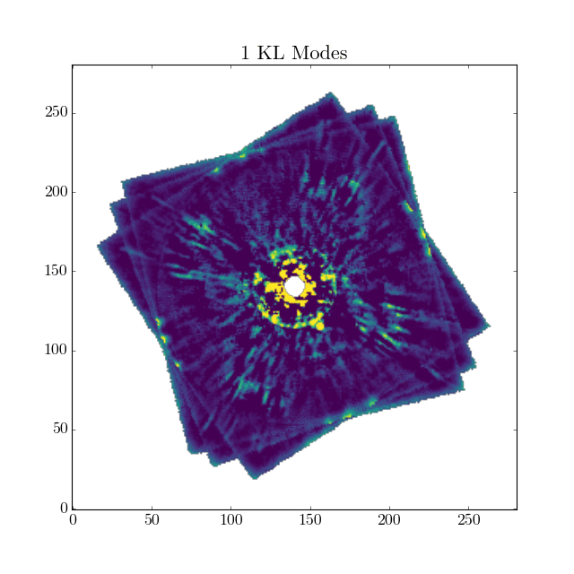
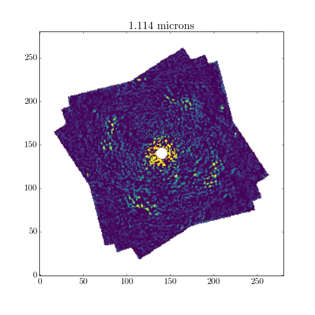

.. _basic-tutorial-label:

Basic KLIP Tutorial with GPI
============================
Here, we will explain how to run a simple PSF subtraction using the KLIP algorithm in pyKLIP. If you are not familiar
with KLIP, we suggest you first read `the KLIP paper <http://arxiv.org/abs/1207.4197>`_ which describes the algorithm
in detail. In this tutorial, we assume you are familiar with the terminology in KLIP. We will use GPI
data as an example to explain the process. If you are planning to reduce data from another instrument, see
:ref:`genericdata-label` to learn how to ingest it. We recommend you go through the quick GPI example first. Other than
reading in the data, all the PSF subtraction steps are the same.

Reading in GPI Data
--------------------

First, you'll need some reduced GPI datacubes to run KLIP on since pyKLIP does not reduce raw data.
If you have raw GPI data you need to reduce, see the
`GPI Data Reduction Pipeline Documentation <http://docs.planetimager.org/pipeline/>`_ page, which has all of the instructions
and tutorials to reduce GPI data. After reducing the data, you should have a series of 3-D datacubes where the third
dimension is either wavelength or polarization depending on if you are working with spectral or polarimetric data.
Regardless, the data should have the satellite spot fluxes and locations measured and stored in the header
as we will need these to register and calibrate the datacubes.
If you don't have any GPI data or are simply too lazy to reduce some yourself,
you can use the reduced Beta Pic datacubes from the
`GPI Public Data Release <https://www.gemini.edu/sciops/instruments/gpi/public-data>`_.

Once you have reduced your data, we can identify and convert the GPI data from GPI specific information
to standardized information for pyKLIP. These initial steps of reading in and parsing the data are demonstrated below:

.. code-block:: python

    import glob
    import pyklip.instruments.GPI as GPI

    filelist = glob.glob("path/to/dataset/*.fits")
    dataset = GPI.GPIData(filelist, highpass=True)

:py:class:`pyklip.instruments.GPI.GPIData` returns ``dataset``, an implementation of the abstract class :py:class:`pyklip.instruments.Instrument.Data` with standardized fields
that are needed to perform the KLIP subtraction, none of which are instrument specific.
Please read the docstring for :py:class:`pyklip.instruments.GPI.GPIData` for more information on the the fields for GPI data.

.. note::
    If you get an error here, you likely did not reduce the raw GPI data correctly, so please check that the satellite spots
    were measured and stored in the header.

.. note::
    When reading in the GPI data, the data are no longer automatically high-pass filtered.
    You should explictly high pass filter the data if desired (we find it is typically good for planet SNR
    using the optional keyword ``highpass=True``. You can also apply the high-pass filter as pre-processing
    step before KLIP in `pyklip.parallelized.klip_dataset` if you don't want to do it here as it is slower.

Running KLIP
-------------

Next, we will perform the actual KLIP subtraction using Angular Differential Imaging and Spectral Differential Imaging (ADI + SDI). To take advantage of the easily parallelizable computation, we will use the
:mod:`pyklip.parallelized` module to perform the KLIP subtraction, which uses the python ``multiprocessing`` library to parallelize the code (i.e. split the work up across multiple processes on your device).

.. code-block:: python

    import pyklip.parallelized as parallelized

    parallelized.klip_dataset(dataset, outputdir="path/to/save/dir/", fileprefix="myobject",
                              annuli=9, subsections=4, movement=1, numbasis=[1,20,50,100],
                              calibrate_flux=True, mode="ADI+SDI")

`pyklip.parallelized.klip_dataset` will save the processed KLIP images in the field ``dataset.output`` and as FITS files saved using the directory and fileprefix
specified. The FITS files contain two different kinds of outputs. The first is a "KL-mode cube", a single 3D datacube where the z-axis is all the
different KL mode cutoffs used to model the stellar PSF. Here is an example KL-mode cube using GPI public data on beta
Pic, where the planet is quite visible.

The second kind of output is a series of spectral datacubes where the z-axis is wavelength and each datacube
uses a different KL mode cutoff as specified by its filename. Here is an example of a 20 KL-mode cutoff cube using the
same GPI data on Beta Pic.

Picking KLIP Parameters for Point Sources
-----------------------------------------
There are a lot of ways to tune the reduction, so check out the  :py:meth:`pyklip.parallelized.klip_dataset` docstring for
all the keywords you can use.
Here, we have provided the keywords which we use the most and should be sufficient for most
cases.

Geometry
^^^^^^^^
We have divided the image into 9 annuli and each annulus into 4
sectors (which do not rotate with the sky) and run KLIP independently on each sector.
Picking the geometry depends on the structure of the PSF, but we have
found this to be pretty good for GPI data.

``annuli_spacing``
""""""""""""""""""
By default we break the image up into equal sized annuli or concentric rings, with the exception of the last annulus which emcompasses the rest of the image.
Each annulus will undergo its own KL mode calculation. Sometimes we want smaller annuli closer in since the stellar PSF changes rapidly there. 
In that case, we suggest setting ``annuli_spacing="log"`` so the widths of the annuli increases logarithmatically. Note that when annuli are further split into 
subsections, each sector does its own KL mode calculation. 

"Aggressiveness"
^^^^^^^^^^^^^^^^
"Aggressiveness" is a key parameter to tune in the PSF subtraction. Increasing the aggressiveness of the PSF
subtraction typically allows you to better model and subtract the stellar PSF. However, doing so also typically
causes any astrophysical flux (e.g. planets, disks) to also be subtracted to a higher degree. Generally, there
is a sweet spot that balances subtracting the stellar PSF and
maintaining the signal of planets and disks. The aggressiveness of the
subtraction is tuned via a combination of the  
"movement" or "minrot" parameters and "numbasis" keywords, as
described below. 

``movement``
"""""""""""""
In our example, we picked PSFs where any potential astrophysical source will have moved by 1 pixel due to ADI (azimuthal motion) and SDI (radial motion)
to build the reference library that constructs our principal components.
Decreasing the movement parameter increases the aggressiveness of the reduction as it will allow you to pick PSFs that are closer in time and
wavelength. However, you will also suffer more self-subtraction of potential astrophysical sources.
We find for GPI data, 1 pixel is good for maximizing the SNR of potential planets in the data.

``numbasis``
"""""""""""""
KL modes are the principal components of the KLIP analysis, representing patterns found in the images that will be used to construct our model of the star. We don't usually pick just one KL basis cutoff for KLIP, but rather an array so we can play aroud with the optimal number.
Increasing the number of KL modes also increases the aggressiveness of the reduction. 
For GPI data, we find between 20-50 KL modes for planet data and 1-10 KL modes
for disk data is optimal. However, with both the ``movement`` and ``numbasis`` parameters, it requires a bit
of searching to find the optimal configuration.

``mode``
""""""""
The ``mode`` keyword specifies whether we'd like to use Angular Differential Imaging (ADI), Spectral Differential Imaging (SDI), Reference Differential Imaging (RDI),
or any combination of the three to perform starlight subtraction. 
ADI creates its principal components by comparing the stillness of a star's PSF across images taken at different angles to a planet's apparent rotation in those same images.
SDI makes use of images taken at a wavelength where we expect planets to peak, as well as images taken a nearby continuum wavelength where we expect stars to remain bright
and planets to become dim. By comparing images at the two wavelengths, KLIP is better able to distinguish the star from the planet, and thus better model and subtract starlight.
RDI uses a library of PSFs taken from other stars to model this star. 
When RDI is specified, pyKLIP will construct its model of the starlight using a reference library of stellar PSF's (passed in by the ``psf_library`` parameter). 
In order to generate this reference library, see the `RDI with a PSF Library <https://pyklip.readthedocs.io/en/latest/rdi.html>`_ documentation.

``spectrum``
""""""""""""
A parameter not specified in this tutorial is the spectral template. Since we know exoplanet spectra should follow
the models (at least roughly), we can use that to better choose reference PSFs to subtract out the stellar PSF.
Currently, the only option is to optimze for T-dwarfs which have sharp methane absorption features. This can be
turned on by setting ``spectrum='methane'``. By doing this, in channels without methane absorption (i.e. where the
planet signal is strong), we will use reference PSFs from channels where with methane abosrption (i.e. where the planet
signal is weak). The aggressiveness of this is tuned with the ``movement`` keyword (i.e. by decreasing ``movement``,
we will allow into the reference PSFs images at wavelengths where the ratio of "no methane abospriton"/"some methane
absorption" is smaller). When this keyword is set, we also do a weighted mean collapse in wavelength for the outputted
KL-mode cubes.

Other
^^^^^
We have also choosen to flux calibrate the data to convert it into contrast units to work in more physical units.

.. note::
   The ``calibrate_flux`` keyword does **not** correct for algorithm throughput, which is a loss of
   flux due to the PSF subtraction process. It merely provides the calibration to convert to contrast units. You
   will then need to correct for algorithm throughput by methods such as fake planet injection.
   See :ref:`contrast-label` which explains how to do this in the context of contrast curves.

There are more parameters that can be tweaked. Read the docstring of :py:meth:`pyklip.parallelized.klip_dataset` for
the full details.

Picking KLIP Parameters for Disks
---------------------------------

Using KLIP for disks can be difficult since the optimal parameters
will depend on the geometry of the disk and the amount of field
rotation in the sequence. Below, we describe some starting
points for tuning the subtraction. Note that for disks it is suggested
to only use mode="ADI" as SDI can severely distort the disk signal.

Geometry 
^^^^^^^^^
PyKLIP splits divides the image into a number of annuli centered
around the center of the image as defined by the ``dataset.centers``
attribute, and splits each of those annuli into a number of
subsections, set by the ``annuli`` and ``subsection`` keywords,
respectively. For disks, we find ``subsections=1`` to be effective. The
number of annuli can also depend on the geometry of the disk, but we
find that ``annuli=1`` is sufficient for most cases and produces
smoother looking reductions.

Aggressiveness
^^^^^^^^^^^^^^^^
The aggressiveness of a PSF subtraction is influenced by a number of
parameters described below. There is often
no one optimal aggressiveness, and there is much to be gained from
both more aggressive and less aggressive reductions. A more aggressive
reduction will allows you to probe features at closer inner working
angles at the cost of killing fainter or more extended features. The
aggressiveness and the parameters you choose can also be affected by
the geometry and strength of the detection. Edge-on disks are more
resilient to more aggressive reductions while face-on disks will need less aggressive
reductions due to the self-subtraction associated with ADI.

Numbasis
^^^^^^^^
Changing the number of basis vectors subtracted will show different
sets of features. More basis vectors will self-subtract more of the
extended PSF structure, showing features in closer inner working
angles while subtracting fewer basis vectors will show more extended
features of the disk.

Minrot
^^^^^^
Given the structure of debris disks, it is preferable to use the
minrot criterion to select basis vectors rather than the movement
parameters as is used in psf subtraction. The choise for this paraeter
will depend on the geometry. For thin disks, a smaller minrot is
desireable as it will allow for a cleaner subtraction while thicker
disks will require a larger minrot to avoid self-subtraction.

