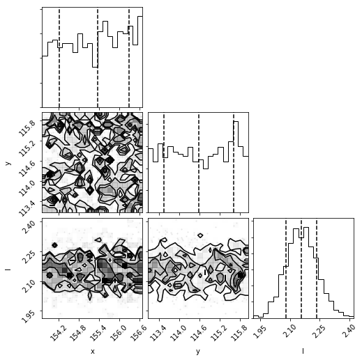

Planet Evidence Module
======================

This tutorial will provide instructions on using the nested sampling implementation to compute the evidence of a detection obtained with the KLIP-FM technique being a true point source or just residual noise along with posterior distributions of the source parameters. This module is useful for providing evidence in a Bayesian framework for a point source detection which by eye may appear uncertain. Planet Evidence runs MultiNest with the forward model (i.e. a planet is present at the guessed planet’s location) and with the null hypothesis (i.e. just noise at the guessed planet’s location).

Attribution
-----------

The PlanetEvidence module has been developed and implemented in pyKLIP by Graça Rocha and Jacob Golomb with contributions from Jason Wang.
If you use this module please cite:

 * `Golomb, J., Rocha, G., Meshkat, T., et al. 2021, AJ, 162, 304. <https://ui.adsabs.harvard.edu/abs/2021AJ....162..304G/abstract>`_

Requirements
------------

To use the Planet Evidence module you must have:

* Data to run PSF subtraction on
* A model or data of the instrumental PSF
* A good guess of the position of the planet (a center of light centroid routine should get the astrometry to a pixel)
* `Pymultinest <https://johannesbuchner.github.io/PyMultiNest/install.html>`_ (click link for installation instructions)
* `corner <https://github.com/dfm/corner.py>`_

Data Reduction to Prepare the Image and Forward Model
-----------------------------------------------------

To prepare the images for analysis, follow the instructions in `Forward-Model Astrometry and Photometry <https://pyklip.readthedocs.io/en/latest/bka.html>`_ up until the :py:class:`pyklip.fitpsf.FMAstrometry` is called (in the ‘Fitting to the Planet PSF’ section).

Fitting the Planet PSF
----------------------

To do the nested sampling process, we will create :py:class:`pyklip.fitpsf.PlanetEvidence` object and feed in the guessed separation and guessed parallactic angle. Then, stamps of thee data and forward model are created (``fit.data_stamp`` and ``fit.fm_stamp``, respectively). MultiNest works by saving its sampling files in a specified directory. If no folder in your working directory has the name you specify, a folder by that name will be created. Because Planet Evidence runs two sampling processes (one for the forward model/planet model, one for the null hypothesis/noise model), we specify that we want the forward model sampling files to be saved in a directory 'chains/' with the prefix ‘Planet’ and the null hypothesis sampling files saved in 'chains/' with the prefix ‘Null’. A local directory for ``sampling_outputdir`` must be specified. If the specified directory does not already exist, it will be automatically created. If nothing is specified for ``fm_basename`` and ``null_basename`` they will automatically revert to ‘Planet’ and ‘Null’, respectively, overwriting any files in your specified directory that have that same prefix!

Note there is also an optional ``l_only`` boolean argument when calling PlanetEvidence. This is to determine if the null hypothesis should be a 1- or 3-parameter model. In the 1-parameter model, we set ``l_only = True``, so the null hypothesis model only samples for the correlation length scale parameter (i.e. the scale of the spatially correlated noise). Setting ``l_only = False`` sets the null hypothesis model to a 3-parameter model where the correlation length scale as well as positional parameters are sampled. In this example, we will use the 3-parameter model.

.. code-block:: python

    # create PlanetEvidence object that does Multinest sampling, set fm_basename and null_basename to the prefixes you want each sampler to save in output_dir
    output_dir = 'chains/' #will save sampling files in the specified directory
    fit = fitpsf.PlanetEvidence(guesssep, guesspa, 13, sampling_outputdir=output_dir, l_only = False, fm_basename='Planet', null_basename='Null')
    # generate FM stamp
    # padding should be greater than 0 so we don't run into interpolation problems
    fit.generate_fm_stamp(fm_frame, [fm_centx, fm_centy], padding=5)

    # generate data_stamp stamp
    # not that dr=4 means we are using a 4 pixel wide annulus to sample the noise for each pixel
    # exclusion_radius excludes all pixels less than that distance from the estimated location of the planet
    fit.generate_data_stamp(data_frame, [data_centx, data_centy], dr=4, exclusion_radius=10)

Next we need to choose the Gaussian process kernel. We currently only support the Matern (ν=3/2)
and square exponential kernel, so we will pick the Matern kernel here.

.. code-block:: python

    # set kernel, no read noise
    corr_len_guess = 3.
    corr_len_label = r"$l$"
    fit.set_kernel("matern32", [corr_len_guess], [corr_len_label])

Priors are necessary for MultiNest to know where in parameter space to sample. We support the use of uniform priors, with those for x and y being flat in linear space and for flux scaling and kernel parameters being flat in log space. In the function below, we will set the boundaries for these priors. The first two values are for x and y and they say how far away (in pixels) from the guessed position of the planet MultiNest will sample. For the ``flux_range`` and ``corr_len_range`` parameters, the values are the magnitude MultiNest can sample from the guessed value (e.g. a value of 1 means we allow a factor of 10 variation in the value). The flux scaling parameter (α) is a multiplicative correction to ``guessflux`` for measuring the photometry. The correlation length (l) is a Gaussian process hyperparameter. 

.. code-block:: python

    # set bounds
    x_range = 1.5 # pixels
    y_range = 1.5 # pixels
    flux_range = 1. # flux can vary by an order of magnitude
    corr_len_range = 1. # between 0.3 and 30
    fit.set_bounds(x_range, y_range, flux_range, [corr_len_range])

Running the Sampler
^^^^^^^^^^^^^^^^^^^

Now we are ready to run MultiNest on the data. We use MultiNest to sample parameter space for the position parameters (x, y), the flux scale, and the correlation length scale. This will sample the “fitting region” around the initial guess values for the position of the planet (specified above). For the forward model case, we sample the four aforementioned parameters within the specified prior range, whereas the null hypothesis case can either be a 3 parameter or 1 parameter noise model. Thus, the evidence for the forward model will be the evidence of the point source detected while the evidence for the null hypothesis will be the evidence that the detection is just noise. 

Running the two samplers is simple:

.. code-block:: python

    #Run the pymultinest fit
    fit.multifit()

This will save the files sampler necessary for analysis in the specified directory (in this case we've set it to a local /chains/ directory). The forward model sampling files will have the prefix set by ``fm_basename`` and the null hypothesis model sampling files will have the prefix set by ``null_basename``.

Analyzing the Data
^^^^^^^^^^^^^^^^^^

For analyzing the data, the posterior distributions of each of the parameters will be of interest. To visualize these, we provided a wrapper to output the corner plots. 

.. code-block:: python

    #Output corner plots from these fits (first figure is the H1 hypothesis, followed up H0)
    fit.fit_plots() 

Here is an example from the beta Pic b J-band GPI data, the posteriors for the forward model followed by the null hypothesis model:

As can be seen by the lack of structure in the first corner plots, the forward model hypothesis converged on the location of the planet, as well as the flux scale and correlation length parameters. The 3-parameter null hypothesis model posteriors are uniform in space, but not for the correlation length scale, as there is spatially-corrected noise present.

The most important benefit of using nested sampling is the ability to obtain the evidence for each model. We will output the statistics from both model runs into a tuple, which will contain two dictionaries.

.. code-block:: python

    #Store the Multinest statistics in a tuple called "evidence". evidence[0] will be a dict
    #with the statistics for the H1 hypothesis. evidence[1] is the same, for the null hypothesis
    evidence = fit.fit_stats()

We have stored the statistics from the forward model run in a dictionary in the 0th element of the ‘evidence’ tuple and those of the null hypothesis run in the 1st element. These dictionaries include the log evidence and the marginal distribution statistics for each parameter. We can store the relevant statistics from these outputs into thee appropriate variables by accessing the information in the dictionaries.

.. code-block:: python

    #Forward model evidence
    fm_evidence = evidence[0]['nested sampling global log-evidence']
    #forward model parameter distributions, containing the median and percentiles for each
    fm_posteriors = evidence[0]['marginals']

    #Null model evidence
    null_evidence = evidence[1]['nested sampling global log-evidence']
    #null parameter distributions, containing the median and percentiles for each
    null_posteriors = evidence[1]['marginals']

.. note::

    The evidence value we use here is the nested sampling global log evidence. If interested, ``evidence`` also includes local log evidence.

Each posterior variable now contains a list, each element of which contains the statistics its respective parameter. For example, ``fm_posteriors[0]`` contains the marginal posterior statistics for the x parameter, ``fm_posteriors[1]`` contains those of the y parameter, and so on. ``null_posteriors`` will have only 3 elements, as it is from a 3 parameter model (no flux scale parameter).

Computing the ratio of the evidences gives the relative likelihood between the two models. For example, we will now quantify which model is favored for our runs on beta Pictoris b, and by how much.

.. code-block:: python

    #Compute evidence ratio for forward model relative to null hypothesis model
    evidence_ratio = np.exp(fm_evidence)/np.exp(null_evidence)
    # or
    #evidence_ratio= np.exp (fm_evidence - null_evidence)

Where the exponentiation is necessary to get the evidences out of ln space. The evidence ratio in this case is on the order of e^175. This result can be interpreted by consulting a resource such as `Table 1 in Trotta (2008) <https://ned.ipac.caltech.edu/level5/Sept13/Trotta/Trotta4.html#Table%201>`_ . (Note that this table uses the ln of the evidence ratio.) In our case, this value is on the order of 175, indicating strong evidence in favor of the forward model (planet) model over the null (noise) model.

We can also examine how the residuals appear in the best-fit region when compared with the input data. To do this, we will use the command ``fm_residuals`` as such:

.. code-block:: python
	fit.fm_residuals()

This will also print the signal-to-noise ratio (SNR) from the residuals, taking the maximum pixel value from the best-fit model and dividing it by the standard deviation of the residuals.

.. image:: imgs/betaPicresiduals.png
